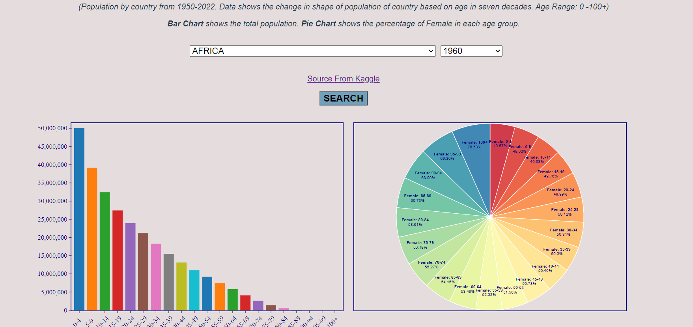

## VUE GRAPH APPS WITH D3, ELASTICSEARCH 7.10.2

+ This project is a full-stack apps with NodeJS and Express in Server side and VUE 3 framework in the client side. The apps shows data
visualization of change of World Population based om Age Range from 0 to 100 +.

+ To test connect with your elasticsearch, come to src/elastic/test and run file health.js (cluster's health) and creatIndex.js (create index). You need to change the connection link with your own elasticsearch link or you need .env file with varaiables for BASE_URL and NODE.

+ The data is saved in elasticsearch from output.json file. If you have .csv file, come to data folder and run index.js to convert your data to json format.

+ The apps is deployed in Heroku and the apps will sleep when the user is unactive. Bonsai ElasticSearch service is used for providing elasticsearch service but due to the free version, cluster can only access by one user and when loading data and calculating by D3 the bar chart and pie chart may show up a bit slowly. 

+ D3 is used to draw bar chart and pie chart based on data they get from Bonsai ElasticSearch. Bar Chart show the total population (sum of female and male) of searched country in each year (seven decades and year range is 10 years) and the population is divided into groups based on Age Range. Pie Chart shows the percentage of Female of totalt population in the same year. 

*** Link to apps in Heroku ***
[Vue-Graph](https://vue-diagram.herokuapp.com/)

